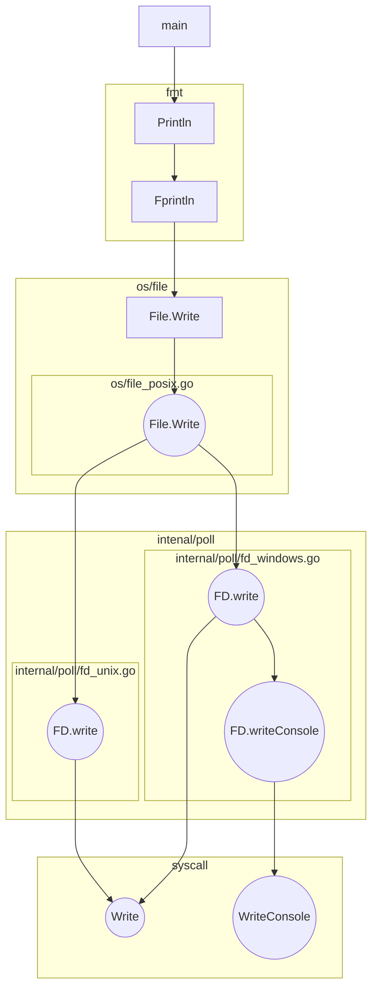

# hello-go

## delveのインストール

<https://github.com/go-delve/delve/tree/master/Documentation/installation>

```bash
go install github.com/go-delve/delve/cmd/dlv@latest
```

## `fmt.Println`のコールグラフ



## gpコマンドのインストール

<https://github.com/tenntenn/goplayground>

```bash
go install github.com/tenntenn/goplayground/cmd/gp@latest
```

## fmt.Scanln関数

https://go.dev/play/p/F6_TPUeLa7X
標準入力から値をポインタで読み取り、変数に格納する。
```go
package main
import "fmt"
func main() {
  var price int
  fmt.Print("値段>")
  fmt.Scanln(&price)
  fmt.Printf("%d円\n", price)
}
```
